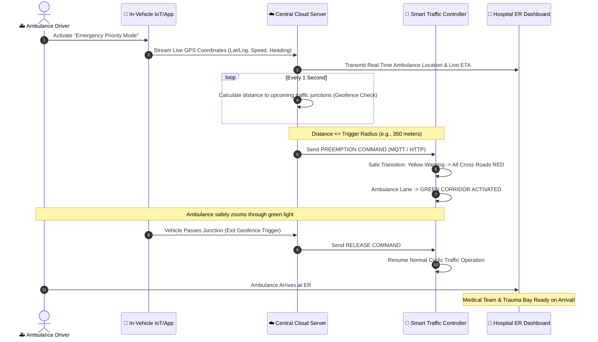

# 🚑 Trapped Ambulance: Smart Emergency Vehicle Clearance & Dynamic Green Corridor System

[](https://opensource.org/licenses/MIT)
[](https://www.espressif.com/)
[](https://flask.palletsprojects.com/)
[](#)
[](https://leafletjs.com/)
[](#)

> **Saving Critical Lives During the "Golden Hour"**  
> An intelligent IoT and Cloud-based traffic preemption system that automatically detects approaching ambulances, clears traffic bottlenecks, and turns traffic signals **GREEN** in real-time to create an uninterrupted **Dynamic Green Corridor**.

---

## 📑 Table of Contents
1. [🌟 Executive Summary](#-executive-summary)
2. [❓ Why This Project? (The Problem We Are Solving)](#-why-this-project-the-problem-we-are-solving)
   - [The "Golden Hour" Reality](#the-golden-hour-reality)
   - [Flaws in Current Systems](#flaws-in-current-systems)
3. [💡 The Proposed Solution](#-the-proposed-solution)
4. [🔄 How It Works: Step-by-Step Workflow](#-how-it-works-step-by-step-workflow)
5. [🏗️ System Architecture & Data Flow](#️-system-architecture--data-flow)
6. [✨ Core Features & Modules](#-core-features--modules)
   - [1. Smart Ambulance Telematics Unit (In-Vehicle)](#1-smart-ambulance-telematics-unit-in-vehicle)
   - [2. Intelligent Traffic Signal Controller (Junction Node)](#2-intelligent-traffic-signal-controller-junction-node)
   - [3. Central Cloud Preemption Engine](#3-central-cloud-preemption-engine)
   - [4. Hospital Trauma Readiness Dashboard](#4-hospital-trauma-readiness-dashboard)
   - [5. Traffic Police & City Management Console](#5-traffic-police--city-management-console)
7. [🧠 Algorithmic Logic Explained Simply](#-algorithmic-logic-explained-simply)
   - [Dynamic Geofencing & Distance Calculation](#dynamic-geofencing--distance-calculation)
   - [Traffic Light State Transition Machine](#traffic-light-state-transition-machine)
   - [Multi-Ambulance Conflict Resolution](#multi-ambulance-conflict-resolution)
8. [🛠️ Hardware & Software Tech Stack](#️-hardware--software-tech-stack)
   - [Hardware Components](#hardware-components)
   - [Software & Web Technologies](#software--web-technologies)
9. [🔌 Circuit Diagram & Hardware Interfacing](#-circuit-diagram--hardware-interfacing)
10. [🚀 Step-by-Step Installation & Setup](#-step-by-step-installation--setup)
11. [📊 Impact & Comparative Analysis](#-impact--comparative-analysis)
12. [🔮 Future Scope & Roadmap](#-future-scope--roadmap)
13. [❓ Frequently Asked Questions (FAQ)](#-frequently-asked-questions-faq)
14. [👥 Contributors & License](#-contributors--license)

---

## 🌟 Executive Summary

In bustling cities worldwide, emergency medical services face a life-or-death crisis: **ambulances getting trapped in severe traffic congestion**. 

The **Trapped Ambulance System** solves this by bridging the gap between emergency vehicles, traffic management infrastructure, and hospitals. Using **GPS Telematics**, **IoT Microcontrollers (ESP32/Arduino)**, **Cloud Geofencing**, and **MQTT/WebSocket communication**, the system creates an automated **Dynamic Green Corridor**:
- As an emergency ambulance approaches a traffic junction, the traffic signal automatically preempts its normal cycle, safely clears cross-traffic, and switches to **GREEN** for the ambulance.
- Once the ambulance clears the intersection, the traffic lights immediately restore normal flow, avoiding road chaos.
- Simultaneously, receiving hospitals receive live telemetry, exact countdown ETAs, and patient triage data to prepare operating rooms ahead of arrival.

---

## ❓ Why This Project? (The Problem We Are Solving)

### The "Golden Hour" Reality
In emergency medicine, the **"Golden Hour"** refers to the first 60 minutes following a severe traumatic injury or acute medical event (heart attack, stroke, brain hemorrhage). 
- Medical research shows that **every 60-second delay in critical care reduces patient survival rates by 7% to 10%**.
- Studies indicate that in major metropolitan areas, ambulances lose **up to 30 to 45 minutes** solely stuck behind red lights and bumper-to-bumper traffic jams.

### Flaws in Current Systems
| Traditional Challenge | Why It Fails |
| :--- | :--- |
| **Siren & Beacon Only** | Sirens are audible only 30–50 meters away in noisy urban environments. By the time drivers hear it, they are packed too tightly to move aside. |
| **Fixed Timer Traffic Signals** | Traffic lights operate on rigid, static countdown timers with zero situational awareness of approaching emergencies. |
| **Manual Traffic Police Green Corridors** | Setting up a green corridor manually requires phone calls between police stations, physical dispatch, and manual switches, taking 20–40 minutes to coordinate. |
| **Blind Hospital Handover** | Hospitals only know the patient’s condition when the ambulance physically arrives at emergency bay doors, leading to lost preparation time. |

---

## 💡 The Proposed Solution

The **Trapped Ambulance Clearance System** automates the entire emergency transit pipeline from dispatch to hospital arrival:

```text
+---------------------------------------------------------------------------------------+
|                                 THE 3-PILLAR SOLUTION                                 |
+---------------------------------------------------------------------------------------+
|  1. DETECT & TRACK       |  2. PREEMPT & CLEAR            |  3. ALERT & PREPARE       |
|  High-precision GPS on   |  IoT-enabled Traffic Signal    |  Hospital dashboard gets  |
|  ambulance streams live  |  switches to GREEN dynamically |  live ETA & patient vitals|
|  position & route.       |  as ambulance enters geofence. |  for zero-wait treatment. |
+---------------------------------------------------------------------------------------+
```

---

## 🔄 How It Works: Step-by-Step Workflow



---

## 🏗️ System Architecture & Data Flow

```text
                               +-----------------------------+
                               |   🚑 AMBULANCE TELEMATICS   |
                               |  - GPS (NEO-6M / Mobile)    |
                               |  - ESP32 / 4G SIM7600       |
                               |  - Driver Emergency Toggle  |
                               +--------------+--------------+
                                              |
                                              | (4G LTE / MQTT / WebSocket)
                                              v
                              +-------------------------------+
                              |    ☁️ CLOUD DECISION SERVER   |
                              |  - Geofencing & Distance Calc |
                              |  - ETA & Route Optimizer      |
                              |  - Multi-Ambulance Arbitrator |
                              |  - Authentication & Security  |
                              +---------------+---------------+
                                              |
                     +------------------------+------------------------+
                     | (Encrypted MQTT / WiFi)                         | (WebSockets / REST API)
                     v                                                 v
      +------------------------------+                  +------------------------------+
      |  🚦 SMART TRAFFIC CONTROLLER |                  |  🏥 HOSPITAL & POLICE PORTAL |
      |  - ESP32 / Arduino Node      |                  |  - Live Map Tracking         |
      |  - 4-Way Relay / LED Signals |                  |  - Exact Countdown ETA       |
      |  - Local Safe State Machine  |                  |  - Patient Vitals Monitor    |
      |  - Fail-Safe Fallback Loop   |                  |  - Pre-arrival Triage Log    |
      +------------------------------+                  +------------------------------+
```

---

## ✨ Core Features & Modules

### 1. Smart Ambulance Telematics Unit (In-Vehicle)
- **High-Precision GPS Tracking**: Real-time position, speed, and heading telemetry streamed every 500ms to 1000ms.
- **One-Touch Emergency Mode**: Drivers can toggle between **Emergency Mode** (active corridor preemption) and **Standard Return Mode** (normal driving without signal overrides).
- **Driver Navigation Assist**: Displays dynamic route suggestions avoiding static roadblocks and heavy construction zones.

### 2. Intelligent Traffic Signal Controller (Junction Node)
- **Microcontroller Integration (ESP32 / Arduino)**: Connects directly to existing junction traffic light relays or modern electronic signal heads.
- **Deterministic State Transition**:
  1. Detects preemption signal.
  2. Runs safe yellow transition for non-priority lanes (prevents abrupt stopping accidents).
  3. Holds **GREEN** in the ambulance approach direction.
  4. Automatically resumes normal cycle when the ambulance passes or after a safety timeout (e.g., 90s fail-safe).

### 3. Central Cloud Preemption Engine
- **Dynamic Geofencing**: Computes real-time Euclidean and Haversine distance between all active ambulances and city intersections.
- **Speed-Adaptive Radius**: Adjusts the preemption trigger distance based on vehicle speed (e.g., at 60 km/h trigger at 400m; at 30 km/h trigger at 200m) to ensure the light turns green *just* as traffic clears ahead.
- **Priority Conflict Resolution**: Resolves scenarios where multiple emergency vehicles approach the same crossroads.

### 4. Hospital Trauma Readiness Dashboard
- **Real-Time Countdown ETA**: Accurate arrival time calculated from live traffic conditions.
- **Patient Status Transmission**: Pre-arrival transmission of vitals (Heart rate, SpO2, Trauma severity level).
- **Bed & Operation Theater Reservation**: Allows hospital dispatchers to assemble specialists before the ambulance arrives.

### 5. Traffic Police & City Management Console
- **City-Wide Live Map**: Overview of all active ambulances and junction statuses across the city.
- **Manual Police Override**: Authorizes central dispatch to manually extend green lights in exceptional emergencies.
- **Audit Trails & Incident Blackbox**: Full timestamped logs of signal overrides for accountability and abuse prevention.

---

## 🧠 Algorithmic Logic Explained Simply

### Dynamic Geofencing & Distance Calculation
The system uses the **Haversine Formula** to compute great-circle distances between the ambulance $(lat_1, lon_1)$ and the traffic intersection $(lat_2, lon_2)$:

$$d = 2R \cdot \arcsin \left( \sqrt{ \sin^2\left(\frac{\Delta lat}{2}\right) + \cos(lat_1)\cos(lat_2)\sin^2\left(\frac{\Delta lon}{2}\right) } \right)$$

- **Trigger Zone (300m - 500m)**: Preemption triggered $\rightarrow$ Cross-traffic switched to Yellow $\rightarrow$ Red.
- **Clearance Zone (0m - 50m)**: Light held solid **GREEN**.
- **Exit Zone (> 50m past junction)**: Normal signal loop restored.

---

### Traffic Light State Transition Machine

```text
[ NORMAL CYCLIC MODE ] (North-South / East-West alternate)
        |
        | Preemption Event: Ambulance Approaching from North (Distance <= 350m)
        v
[ TRANSITION STATE ] (All current green lanes turn YELLOW for 3 seconds)
        |
        | Safe clearance complete
        v
[ PREEMPTION ACTIVE ] (East, West, South = RED | North = GREEN)
        |
        | Ambulance Crosses Junction (Exit Geofence) OR Safety Timeout (90s max)
        v
[ RECOVERY STATE ] (Safe yellow transition)
        |
        v
[ RESUME NORMAL CYCLIC MODE ] (Resumes balanced cycle timing)
```

---

### Multi-Ambulance Conflict Resolution
When two or more emergency vehicles approach the same intersection at the same time, the central arbiter evaluates:
1. **Critical Severity Grade**: Critical Trauma / Cardiac Arrest > Stable Transport.
2. **Estimated Time to Intersection (TTI)**: $\text{TTI} = \frac{\text{Distance}}{\text{Current Speed}}$. The vehicle with the shortest TTI is granted clearance first.
3. **Sequential Staging**: Once Vehicle 1 passes through, the green phase immediately shifts to Vehicle 2's lane before returning to general traffic.

---

## 🛠️ Hardware & Software Tech Stack

### Hardware Components
| Component | Purpose | Key Specifications |
| :--- | :--- | :--- |
| **ESP32 DevKit V1** | Central IoT Microcontroller | Dual-core 240MHz, Built-in Wi-Fi & Bluetooth, Low Power |
| **NEO-6M GPS Module** | Positioning & Telematics | 50-channel GPS engine, High accuracy tracking, Ceramic antenna |
| **SIM800L / SIM7600 4G** | Cellular Internet Connectivity | GSM/GPRS or 4G LTE communication for remote telemetry |
| **4-Channel Relay Module** | Traffic Light Switching | Optocoupler isolation, 5V trigger, 250V/10A switching capacity |
| **Traffic Light LEDs / Model** | Junction Simulation | Red, Yellow, Green 10mm LEDs or standard 12V traffic modules |
| **Buzzer / Audio Siren** | Audio Alerting | Local audible status indicator |
| **Power Supply** | Microcontroller Power | 5V/2A DC regulated adapter or step-down buck converter |

### Software & Web Technologies
- **Backend Server**: Python (Flask / FastAPI) or Node.js (Express).
- **Communication Layer**: MQTT (Mosquitto Broker) for sub-second IoT messages + WebSockets for live browser map streaming.
- **Frontend Dashboard**: HTML5, Modern CSS (Glassmorphism / Tailwind), JavaScript (ES6+).
- **Mapping & Geolocation**: Leaflet.js / OpenStreetMap API / Google Maps API.
- **Database**: SQLite / MySQL / MongoDB (stores vehicle IDs, junction logs, telemetry history).
- **Firmware**: C++ / Arduino IDE / ESP-IDF.

---

## 🔌 Circuit Diagram & Hardware Interfacing

### ESP32 to NEO-6M GPS Pin Mapping
```text
  +------------------+             +--------------------+
  |  ESP32 DevKit    |             |  NEO-6M GPS Module |
  |                  |             |                    |
  |             3.3V |------------>| VCC                |
  |              GND |------------>| GND                |
  |     GPIO 16 (RX2)|------------>| TX                 |
  |     GPIO 17 (TX2)|------------>| RX                 |
  +------------------+             +--------------------+
```

### ESP32 to 4-Channel Traffic Light Relay Pin Mapping
```text
  +------------------+             +--------------------+
  |  ESP32 DevKit    |             | 4-Channel Relay /  |
  |                  |             | Traffic LED Module |
  |               5V |------------>| VCC                |
  |              GND |------------>| GND                |
  |     GPIO 25 (IN1)|------------>| RED Light Relay    |
  |     GPIO 26 (IN2)|------------>| YELLOW Light Relay |
  |     GPIO 27 (IN3)|------------>| GREEN Light Relay  |
  |     GPIO 14 (IN4)|------------>| Cross-road Red     |
  +------------------+             +--------------------+
```

---

## 🚀 Step-by-Step Installation & Setup

### 1. Prerequisites
- [Python 3.9+](https://www.python.org/downloads/) installed.
- [Arduino IDE](https://www.arduino.cc/en/software) installed (for ESP32 hardware flashing).
- Git installed.

### 2. Clone the Repository
```bash
git clone https://github.com/your-username/trapped-ambulance-system.git
cd trapped-ambulance-system
```

### 3. Setup Python Backend Server
```bash
# Create virtual environment
python -m venv venv

# Activate virtual environment
# Windows:
venv\Scripts\activate
# Linux/macOS:
source venv/bin/activate

# Install dependencies
pip install flask flask-cors flask-socketio paho-mqtt requests
```

### 4. Flashing the ESP32 Traffic Node
1. Open Arduino IDE.
2. Go to **Tools -> Board -> ESP32 Dev Module**.
3. Install required libraries via Library Manager:
   - `TinyGPSPlus` (by Mikal Hart)
   - `PubSubClient` (by Nick O'Leary)
   - `ArduinoJson` (by Benoit Blanchon)
4. Open `firmware/traffic_node_esp32.ino`.
5. Enter your Wi-Fi SSID, Password, and MQTT Server IP.
6. Connect ESP32 via USB and click **Upload**.

### 5. Launch the System
```bash
# Run the Central Decision Server
python app.py
```
Open your browser and navigate to:
- **City Traffic & Live Tracking Console**: `http://localhost:5000`
- **Hospital Emergency Dashboard**: `http://localhost:5000/hospital`
- **Ambulance Driver Simulator**: `http://localhost:5000/driver`

---

## 📊 Impact & Comparative Analysis

| Metric / Parameter | Traditional Manual System | Trapped Ambulance (Smart Preemption) |
| :--- | :--- | :--- |
| **Average Junction Delay** | 90 - 180 seconds per red light | **0 - 5 seconds (Zero Stop Corridor)** |
| **Response Time Reduction** | Standard transit duration | **35% to 52% Faster Transit** |
| **Intervention Coordination** | 20-30 min phone calls to police | **Automated & Instantaneous (< 1 sec)** |
| **Hospital Readiness** | 0 min pre-warning (Blind arrival) | **10 - 20 min advance trauma prep** |
| **Human Error Rate** | High (missed signals / delayed clearance) | **Near 0% (Fail-Safe Algorithm)** |
| **Scalability** | Expensive manual manpower | **Modular, Low-Cost IoT Scalable** |

---

## 🔮 Future Scope & Roadmap

- [ ] **V2X (Vehicle-to-Everything) DSRC Integration**: Direct car-to-car communication to alert all surrounding civilian vehicles on their dashboard screens to move aside.
- [ ] **AI Congestion & Drone Assistance**: Deploy autonomous scout drones to identify road bottlenecks and stream real-time aerial footage to the ambulance driver.
- [ ] **Integration with National Emergency Numbers (108 / 911 / 112)**: Automatic routing and dispatching directly triggered upon receiving an emergency call.
- [ ] **Adaptive Signal Timing (Machine Learning)**: Dynamically adjust citywide signal cycles after emergency passage to dissolve secondary traffic buildup rapidly.

---

## ❓ Frequently Asked Questions (FAQ)

<details>
<summary><b>1. What happens if the internet or cellular connection drops?</b></summary>
The system incorporates a multi-tier fallback mechanism. In the event of cloud disconnection, vehicles and traffic nodes can communicate locally using direct RF (LoRa / 433MHz / ESP-NOW) within a 500m radius. If all wireless links fail, the traffic light automatically remains in its normal, safe cyclic state.
</details>

<details>
<summary><b>2. Will creating green corridors cause major traffic jams on cross streets?</b></summary>
No. The green light is held *only* for the exact duration required for the ambulance to cross (typically 12–20 seconds). As soon as the vehicle's exit geofence is triggered, the controller immediately rebalances cross-street traffic cycles to eliminate congestion.
</details>

<details>
<summary><b>3. How does the system prevent unauthorized abuse of green corridors?</b></summary>
All emergency preemption requests are cryptographically authenticated with signed tokens tied to registered ambulance vehicle IDs. Every override is recorded with GPS logs, timestamp, and speed in an immutable audit ledger reviewed by traffic police authorities.
</details>

<details>
<summary><b>4. Can this system work with existing traffic infrastructure?</b></summary>
Yes. The ESP32 / Arduino controller is designed as an add-on retrofit module that interfaces with the existing traffic signal switching relays without requiring expensive civil reconstruction.
</details>

---

## 👥 Contributors & License

- **Project Lead & Developer**: Sai Prakash N
- **License**: This project is open-source under the [MIT License](LICENSE).

---

<p align="center">
  <b>🚨 Every Second Counts. Empowering Emergency Transit Through Intelligent Engineering. 🚑</b>
</p>
